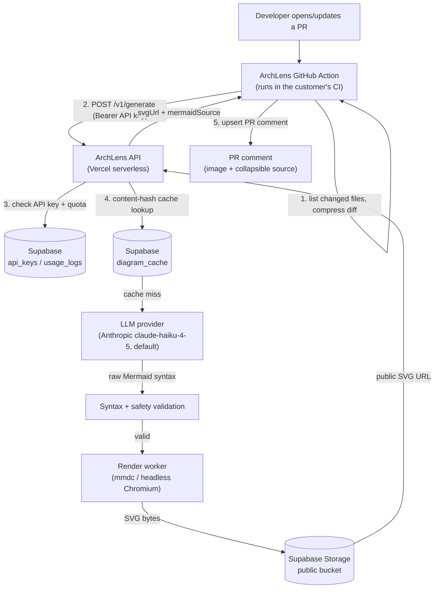

# ArchLens AI — Architecture

## What it does

On every pull request that touches a structurally significant file (routes,
controllers, SQL/Prisma/GraphQL schema, migrations), ArchLens posts a single
PR comment containing an AI-generated Mermaid diagram of that diff's system
impact, and keeps updating the same comment as the PR changes.

## System diagram

## Why this differs from the original brief

The original brief had the Action itself calling an LLM and rendering with
`mermaid-cli` inside the customer's own CI runner. Both of those were
reconsidered:

- **Rendering never happens in the customer's CI.** `mermaid-cli` bundles a
  full headless Chromium via Puppeteer — installing and launching that on
  every single PR run adds real minutes to a customer's CI and is a common
  source of flakiness across differently-configured Ubuntu runner images.
  Rendering happens once, server-side, on infrastructure ArchLens controls,
  and the Action receives back a plain URL to embed. The customer-side
  Action has zero Puppeteer/Chromium dependency at all — confirmed by the
  620KB single-file bundle in `action/dist/index.js`, whose only runtime
  dependencies are `@actions/core`, `@actions/github`, and `minimatch`.
- **The content-hash cache is checked before quota or the LLM call**, not
  after. A PR that gets a trivial follow-up commit (typo fix, rebase, CI
  retry) that doesn't change the content of any matched file produces the
  same hash — so it's served from cache, burns zero quota, and costs zero
  LLM tokens. This is the single biggest lever on unit economics for a
  product whose primary cost driver is inference calls.
- **Anthropic (`claude-haiku-4-5`) is the default provider.** This
  deployment reuses an existing Anthropic account rather than provisioning
  a fresh OpenAI key — but under its **own Anthropic Console project**, so
  ArchLens's token spend and usage are separately visible from whatever
  else runs on that account, exactly the same "same account, different
  project" pattern used for Supabase below. `backend/lib/llm.ts` also
  supports OpenAI and DeepSeek, opt-in via `ARCHLENS_LLM_PROVIDER`, for
  deployments without that constraint. DeepSeek in particular stays opt-in
  only — sending a paying customer's private-repo diff to a
  Chinese-domiciled model provider by default is a data-residency and
  trust risk most SMB/enterprise buyers in ArchLens's target market
  (Western/global engineering teams) will not accept without being asked.
- **The Action treats a generation failure as a soft failure by default**
  (posts an explanatory comment, doesn't fail the CI run) unless
  `fail-on-error: true` is set. A red X on a PR because a diagramming tool's
  backend had a bad moment is exactly the kind of friction that gets a tool
  like this uninstalled within a week.

## Security model

PR content is attacker-influenced by definition — anyone can open a PR. That
diff flows through an LLM and the result is rendered and hosted as SVG
embedded in other people's PR pages. `backend/lib/mermaid.ts` treats the
model's output as untrusted input, not as this app's own template:

- Only two diagram declarations are accepted (`flowchart TD/LR/BT/RL`,
  `sequenceDiagram`) — anything else is rejected outright.
- Mermaid `click` bindings (which can invoke arbitrary JS), `<script>`,
  `javascript:`, inline event handlers, and `<foreignObject>` are all
  rejected before rendering is ever attempted.
- Output is capped at 20,000 characters to bound rendering cost and rule out
  abuse via a maximally verbose diagram.
- If the model's first attempt fails validation, one repair attempt is made
  with the exact validation error fed back in; if that also fails, the
  request returns `502 upstream_generation_failed` rather than rendering
  anything.

## Billing model (and why it isn't GitHub Marketplace's built-in billing)

GitHub Marketplace's native metered/subscription billing is wired up for
**GitHub Apps**, not for a plain Action. ArchLens is listed on Marketplace
for discovery only. Actual billing is Stripe Checkout
(`api/checkout.ts`) issuing an `alk_live_...` API key on
`checkout.session.completed` (`api/webhook/stripe.ts`), which the customer
pastes into their workflow as the `archlens-api-key` input (a repo/org
secret). Quota enforcement (`backend/lib/quota.ts`) and content-hash caching
(`backend/lib/cache.ts`) both run against Supabase, gating every request the
Action makes to `/v1/generate`.

Both routes are thin Vercel wrappers over pure, dependency-injected handlers
— `backend/lib/checkout-handler.ts` and `backend/lib/webhook-handler.ts` —
following the same pattern as `generate-handler.ts`. This isn't just a style
preference: it's what makes the webhook's Stripe-signature verification and
provisioning logic unit-testable at all without a live Stripe account,
using `stripe.webhooks.generateTestHeaderString` to construct genuinely
validly-signed test payloads (pure local HMAC, no network call, no account
needed) — see `backend/tests/webhook-handler.test.ts`.

**Payment-failure handling deliberately reacts to `customer.subscription.
updated`, not raw `invoice.payment_failed`.** `invoice.payment_failed`
fires on *every* retry attempt during Stripe's dunning/Smart Retries flow,
not just the final one — gating API access on the first occurrence would
cut off a paying customer's whole team over one transient card decline,
before Stripe's own retry schedule even gets a chance to succeed. Instead,
access is only revoked once the subscription itself transitions to
`unpaid`/`canceled` (which Stripe does automatically after retries are
exhausted), and is restored if it recovers back to `active`. A `past_due`
subscription is left alone — a deliberate grace period, not an oversight.
`customer.subscription.deleted` remains a hard, immediate cutoff.

## Visual design

The first version of the renderer (`backend/lib/mermaid.ts`) passed Mermaid's
output straight to `mmdc` with only `-b transparent` — no theme, no font, no
color, no grouping. It worked, but it produced generic default-Mermaid boxes
indistinguishable from a five-minute mermaid.live sketch — not something a
team would pay $12-29/month for. The fix isn't cosmetic-only; it also caught
a real correctness bug:

**A note on `foreignObject`, corrected after this was first written.**
Mermaid v10+ defaults flowchart labels to HTML text rendered inside
`<foreignObject>` elements rather than plain SVG `<text>`. An early test
that rasterized the SVG via `sharp`/librsvg for a quick visual check came
out with completely blank labels, and a first, hasty test of the real
``-embed path (loaded over `file://`, not `http://`) also came out
blank — both were read as proof that GitHub itself would show invisible
text on every flowchart ever generated, and that was written up here and
told to Anurag as a confirmed ship-blocking bug. It wasn't warranted. A
proper re-test — a real local HTTP server, real headless Chromium, an
actual `` tag, an explicit wait for the image to finish
decoding before screenshotting — renders `foreignObject`-based labels
completely correctly. The `sharp`/librsvg result was a rasterizer
limitation (librsvg doesn't support `foreignObject`) that has nothing to
do with how GitHub or a real browser display the image, and the first
`file://` test was very likely blocked by Chromium's own restrictions on
loading local files cross-origin, not by `foreignObject` itself. **The
"every diagram ever posted was invisible" claim was wrong** — filed here
as a correction, not quietly dropped, because it was stated as fact.

What's still true and still worth keeping: `flowchart.htmlLabels: false`
(plain SVG `<text>` instead of HTML-in-`foreignObject`) is a reasonable
hardening choice on its own merits — it's more portable across SVG
consumers in general (this is a real, independently-documented complaint
against Mermaid's foreignObject labels — see the tool's own issue tracker
on cross-application compatibility), and it removes any dependency on
however GitHub's own image-serving path happens to treat embedded HTML
inside an SVG, which was never actually tested against a live GitHub PR
from this sandbox (no push access here) and is the one piece that's still
genuinely unverified. So the change stays, `backend/tests/mermaid.test.ts`
keeps its regression test against `foreignObject`, but it should be
described as a portability/defensive improvement, not as fixing a
confirmed live outage. Worth a real spot-check — post one actual PR
comment once this is deployed and open it on github.com — before this
section is trusted at face value.

**The theme itself** is a dark palette derived from GitHub's own Primer
design tokens (background `#0d1117`, node fill `#1c2128`, text `#e6edf3`,
line `#8b949e`) so a diagram feels native to a PR page rather than a
generic chart export, plus a system-font stack for legible text at GitHub's
default zoom. Three fixed node categories give diagrams instant visual
hierarchy instead of one undifferentiated color: `endpoint` (blue, routes/
controllers), `logic` (green, services/business logic), `datastore` (purple,
tables/schemas/queues). `backend/lib/llm.ts`'s prompt asks the model to
group nodes into `subgraph` blocks by architectural layer (API/logic/data)
and assign each node exactly one category via a `class` line — but
**never** to define its own `classDef`. `backend/lib/mermaid.ts`'s
`applyArchLensStyling()` strips any `classDef` the model emits anyway and
appends ArchLens's own fixed one, so branding stays consistent regardless of
what the model does and a model can't push arbitrary styling through. For
sequence diagrams, the prompt asks for `autonumber` (so reviewers can
reference "step 4" in a PR comment) and sparing `Note over` callouts on
non-obvious side effects (external calls, DB writes, async jobs) — not one
on every message, which would just be noise.

**Deliberately not done (scope calls, not oversights):** no light-mode
variant / GitHub `<picture>` + `prefers-color-scheme` adaptive image yet —
that needs a second render + second Storage upload + `<picture>` markup in
`action/src/comment.ts`, tracked as a follow-up, not built speculatively
before it was asked for. No pivot to D2 or another diagram language — would
mean rebuilding the security allow-list, prompt, and renderer from scratch
for a look Mermaid's theming already gets most of the way to.

## Deployment topology (recommended, not required to run tests)

- **`api/generate.ts`, `api/checkout.ts`, `api/webhook/stripe.ts`**: Vercel
  serverless functions — lightweight, no Chromium dependency.
- **Render step**: Puppeteer/Chromium is a poor fit for Vercel's ephemeral
  serverless functions (cold starts, the ~50MB compressed function size
  limit). Two supported options, both already isolated behind
  `renderMermaidToSvg`'s `executablePath` option:
  1. A small always-on container (Fly.io/Railway/Render.com) running `mmdc`
     directly — simplest, recommended for launch.
  2. `@sparticuz/chromium-min` + `puppeteer-core` inside a Vercel function,
     if consolidating onto one platform matters more than avoiding
     cold-start latency.
- **Supabase**: Postgres (`db/schema.sql`) for `orgs`/`api_keys`/
  `usage_logs`/`diagram_cache`, plus Storage for the rendered SVG bytes.

## Verified, not assumed

`npm test` (84 tests across both workspaces) and `npm run dry-run` are both
green as of this writing. The dry run
(`scripts/dry-run.ts`) is the important one: it runs the Action's real diff
compression and HTTP client against the real backend handler over a real
HTTP connection, with a real `mmdc` render (headless Chromium), and asserts
on the actual rendered SVG bytes and the actual final PR comment markdown —
not two halves of mocked unit tests that never touch each other.
