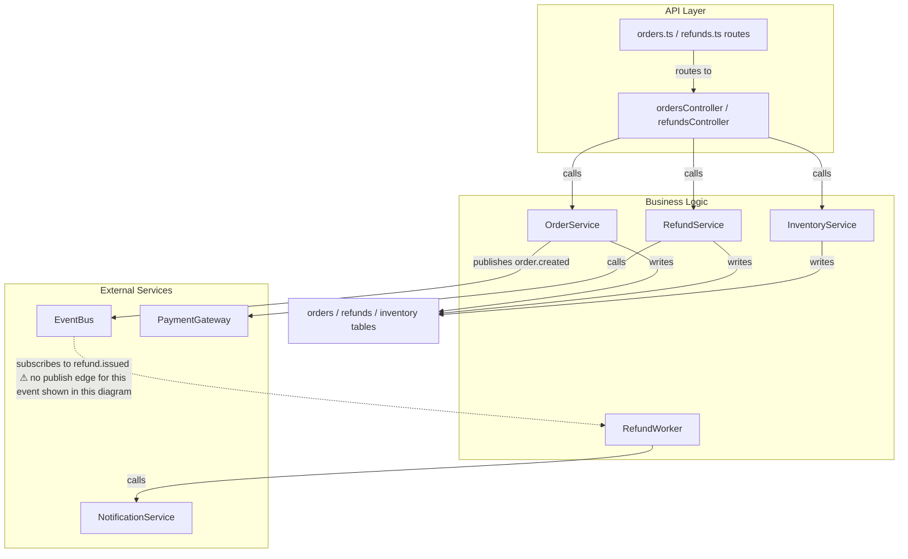

<!-- archlens-ai-comment -->
### 🤖 Architecture Map — generated by ArchLens AI · PR #512 · 10 files matched

> ℹ️ This PR touches 10 files — the diagram groups related changes at the file/module level to stay readable, rather than showing every function individually. See the full diff for complete detail.

Mermaid source

*Visual Architecture Map Generated by [ArchLens AI](https://archlens.dev) · [Add ArchLens to your repo →](https://github.com/marketplace/actions/archlens-ai)*
